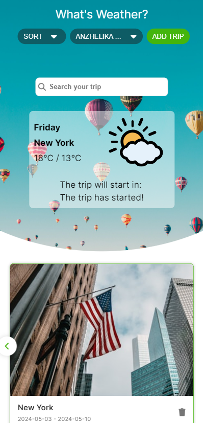

<h1 align="center">About app «What's weather?»</h1>

«What's weather?» is trip app with countdown timer and weather forecast. The user can create, store and delete travel cards. Adaptive app for mobile tablet and desktop.

</img>

</img>

---
## How to use the application

- To start using the application, click on the button <button style="color: #fff; cursor: pointer; border: none; border-radius: 100px;font-size: 15px;line-height: 24px; outline: none;padding: 0 16px;text-transform: uppercase;height: 32px; background-color: #44b50c;">Add trip</button> in the header.
- After this, a modal window will open where you need to enter the name of the city and travel dates (start and end).
- After clicking on the Save button, a trip card will appear, which will display a photo of the specified city, its name, dates.
- When you click on a trip card, the weather forecast for the selected dates will appear at the bottom of the list with cards and a widget with current information at the top.
- You can **`delete`** cards, **`sort`** them, and also **`search`** for specific cards in the search field by city name.
- After reloading the page, the cards remain in place.
- You can also **`log in`** the app using Google to sync the app with other devices. 
To do this, click on the button    <button style="color: #fff; cursor: pointer; border: none; border-radius: 100px;font-size: 15px;line-height: 24px; outline: none;padding: 0 16px;text-transform: uppercase;height: 32px; background-color: grey">Login</button>

> Important: 
1. You can select dates within the next two weeks. 
2. Select the city from the drop-down list.
3. Select the dates from the drop-down calendar

---

## Live Demo: [click here](https://drive.google.com/file/d/1XdBEWft-oU3yMGhedLWC6XcXebNbKIcE/view?usp=sharing) 👈

---

 ## Technologies and API used

   

[https://unsplash.com/developers ](https://unsplash.com/developers)  - Getting image of city API

[https://www.geoapify.com ](https://www.geoapify.com/) - Geolocation API

[https://www.visualcrossing.com](https://www.visualcrossing.com/) - Weather API

[https://firebase.google.com](https://firebase.google.com/) - Firebase Autentification and Realtime Database

APIs have their limitations as they are used in the free version. 

## Deployment

Visit the app by following this link https://trip-weather-iota.vercel.app/

This project was bootstrapped with Create React App.

